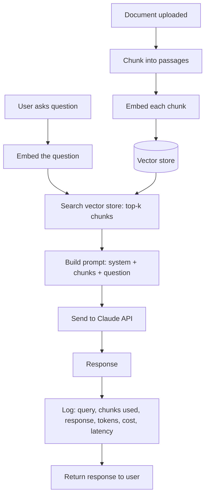
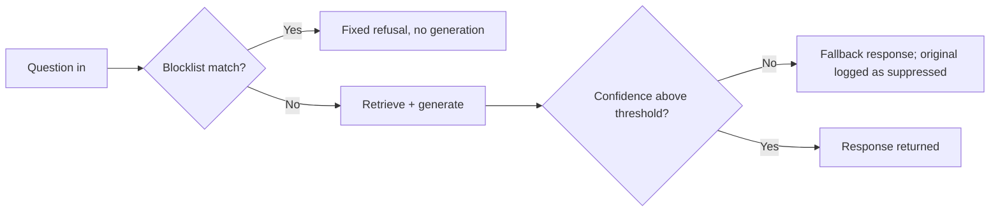
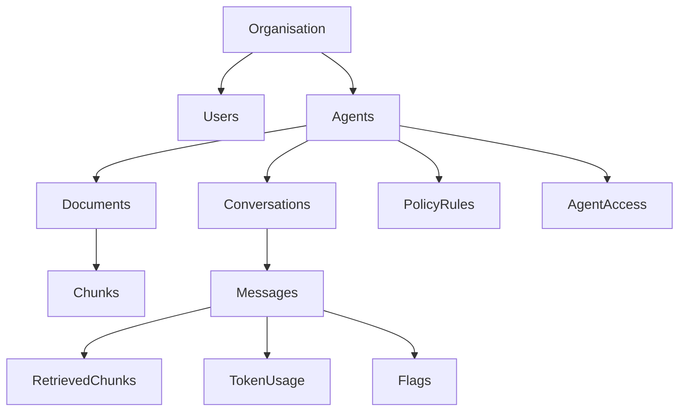
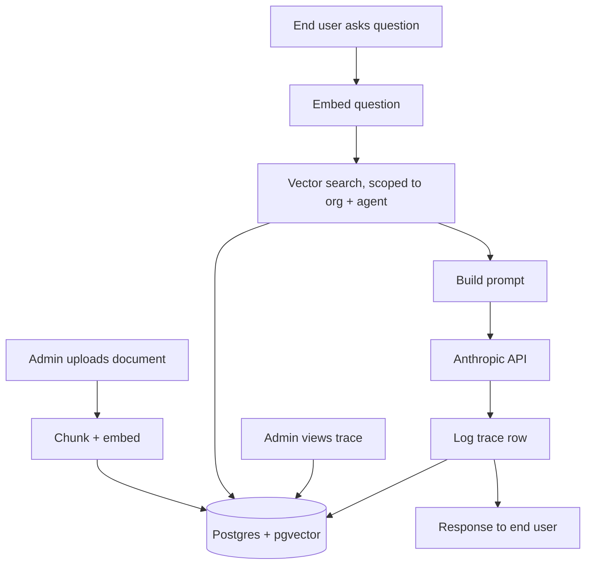

# Governed Agent Platform — Project Scope

*Sep 25, 2026 · @Kunal Kumar — stack decisions updated Oct 1, 2026*

## The problem

Companies want to put AI agents in front of staff and customers, backed by their own documents — policy manuals, FAQs, product docs, internal wikis. The technology to do this is not hard to demonstrate. A weekend project can wire an LLM to a document store and get something that answers questions.

What is hard, and what most demos skip, is everything that comes after the demo works:

- Nobody can tell why the agent said what it said. When it gives a wrong answer, there is no record of which document it pulled from or why it picked that one.
- Nobody controls what it is allowed to say. There is no way to say "if you are not confident, say so" or "never answer questions about X" without retraining or rewriting the whole prompt by hand.
- Nobody knows what it costs. Token spend is invisible until the API bill arrives.
- Nobody can audit a specific answer after the fact. If a customer disputes what the agent told them, there is no record to check against.

This is the gap between "an AI chatbot" and "an AI system a business can actually deploy and stand behind." The market segment addressing this gap — governed, auditable enterprise agents — is where this category of platform operates. The problem is not building an agent. It is building the layer of visibility and control around the agent that lets an organisation trust it enough to put it in front of real users.

## Vision, goals and non-goals

A platform where an organisation uploads its own documents, configures an AI agent against them, and gets full visibility into every answer that agent gives — what was asked, what was retrieved, what was sent to the model, what came back, what it cost, and who reviewed it.

### Goals

- An admin can create an agent, upload documents, and have it answering questions within minutes.
- Every response is traceable to the exact retrieved content and exact prompt that produced it.
- An admin can inspect any past conversation and see precisely why the agent said what it said.
- Policy rules — confidence thresholds, blocked topics — are configuration, not code, and take effect immediately.
- Cost is visible per query, per agent, and per organisation, in near real time.
- An end user gets a plain chat interface with none of the governance machinery visible to them.

### Non-goals for v1

- Fine-tuning. Retrieval over uploaded documents only. No custom model training.
- Voice or multi-modal input. Text in, text out.
- Third-party integrations (Slack, Teams, a helpdesk). The chat interface is a standalone shareable link.
- Billing and payments. No subscription tiers, no metered billing to the organisation. Cost tracking is observability, not invoicing.
- Fine-grained per-document permissions. All documents in an agent's knowledge base are available to that agent's retrieval. Document-level access control is a real feature of mature platforms in this space, and is explicitly deferred, not solved badly.
- Multi-agent conversations. One agent answers each conversation. No agent-to-agent handoff.
- **Bring-your-own-database isolation.** Considered a Pinecone-style model where each admin supplies their own database so their data never touches shared infrastructure — declined for v1 in favour of shared Postgres with foreign-key-enforced tenancy and row-level security (see *Architecture and stack*). Customer-managed data residency is real production scope, properly deferred for the same reason as the other items on this list, not solved partially.

**The single sentence test.** If someone asks what this is: a platform where organisations deploy document-backed AI agents with a full audit trail behind every answer.

## Roles and access

Two roles, and a boundary drawn deliberately: the end user sees none of the governance layer.

**Admin** is the operator: an ops manager, a small business owner, an IT lead — whoever is accountable for what the agent says. They configure agents, review behaviour, and own the cost.

**End user** is whoever the agent serves: staff consulting an HR-policy bot, or customers using a support bot. Their entire experience is a clean chat window at a shareable link. No trace, no confidence scores, no visible machinery. The governance exists behind them, not in front of them — a support agent who sees "confidence: 62%" attached to every answer trusts the system less, not more.

A third tier — organisation — is structural but not a role. The data model is multi-tenant from day one (every agent, document and conversation belongs to an organisation), but v1 has one admin per organisation and no team management, invites, or per-seat permissions. That is real scope, correctly deferred rather than solved partially.

Per-agent access, not per-platform access. Each agent is independently set to Public (anyone with its shareable link, no login) or Restricted (login required, checked against an email allowlist the admin maintains for that specific agent). This is a per-agent setting, not a global rule, because the two End user cases above want opposite defaults — a customer-facing support bot should stay frictionless, while a staff-facing HR or legal bot should be gated. All roles authenticate through the same login/sign-up flow, including OAuth; a Public agent simply never triggers that flow for its visitors. This sits alongside, not in place of, the deferred team management above: the allowlist controls who may chat with one agent, not who administers the organisation's console.

## Surfaces and features

Seven screens. Each one earns its place; nothing here is decoration.

### 1. Dashboard

The admin's landing page after login. Four numbers, refreshed on load: total agents, queries this week, responses flagged for review, and estimated spend so far this billing period. A one-line summary, not a report — the point is to answer "is anything on fire" in under five seconds.

### 2. Agents list → Create agent

A list of the organisation's agents, each showing name, query volume, and last-active time. Creating one asks for:

- **Category** — one of five presets (Law/Compliance, Marketing, HR, IT/Internal Knowledge Base, Customer/Product Support). Selecting one pre-fills a starter system prompt and a starter keyword blocklist; both are fully editable, not locked
- **Name** — e.g. "HR Policy Bot"
- **System prompt** — tone, scope, what to refuse; pre-filled from the chosen category and editable
- **Documents** — PDF or text uploads that become the knowledge base
- **Access** — Public (anyone with the link, no login) or Restricted (login required; the admin manages an email allowlist of who may enter)

On upload, each document is chunked, embedded, and stored — the RAG pipeline detailed in its own section below. The admin sees a progress state per document (processing, ready, failed) rather than a silent wait.

### 2a. Agent categories, starter prompts and access

Five categories cover the common cases without building a category system that needs its own maintenance: Law/Compliance, Marketing, HR, IT/Internal Knowledge Base, and Customer/Product Support. Choosing one at creation time pre-fills a starter system prompt and a starter keyword blocklist — the admin can edit either, or leave both as given.

**Why a blocklist, not just prompt wording.** The starter blocklist exists because "defer to a human for X" is a governance decision, not a tone decision. Putting it only in prose in the system prompt makes it a soft, best-effort instruction the model can occasionally miss — and it burns tokens generating an answer that gets thrown away anyway. A blocklist match is checked before retrieval runs at all (see *Policy rules*), so the redirect is deterministic and no tokens are spent on a question that was always going to be refused. The starter prompt handles tone and scope; the starter blocklist handles the hard "never answer this, point them to a person" cases; the confidence threshold, also configurable per agent, catches the long tail of "not sure" cases that cannot be enumerated as keywords in advance.

**Access.** Access is set per agent, not platform-wide, because the two end-user cases this document describes want opposite defaults: a customer-facing support bot should stay frictionless (Public — anyone with the link, no login), while a staff-facing bot such as an HR or legal agent should be gated (Restricted — login required, checked against a per-agent email allowlist the admin maintains on that agent's settings page, where emails can be added or removed at any time). All roles — admin and end user alike — authenticate through the same login/sign-up flow, including OAuth; a Public agent simply never triggers that flow for its visitors.

### 3. Agent detail page

All conversations a given agent has had: timestamp, who asked, the first line of the question, and whether it was flagged. This is the index into the trace screen — an admin scans this list to find the conversation worth inspecting.

### 4. Conversation trace — the governance centrepiece

Covered in full in its own section. In outline: the exact question, the retrieved chunks with source filenames, the full prompt sent to the model, the response, token cost, and a flag control. This is the screen that makes the platform's value proposition visible rather than assumed.

### 5. Chat interface

The end-user surface, at a shareable link — no login for a Public agent, or a quick login for a Restricted one. A clean window: type, get an answer. Nothing else. This is deliberately the least interesting screen in the product — the interest lives in the layer behind it.

### 6. Analytics

Queries per day, cost over time, top questions grouped by topic, and flagged-response rate. This answers one question for the admin: is this agent actually working. A rising flag rate or a cluster of unanswered questions around one topic is the signal that the knowledge base needs another document.

### 7. Policy rules

Covered in its own section. In outline: confidence-based fallback behaviour and keyword-based refusals, checked before a response is returned, editable without a redeploy.

## The RAG pipeline

Every query follows the same path. This section is the one to know cold in an interview, because it is the mechanism the whole governance story depends on.

### Ingestion (happens once per document)

**Chunking.** Split the document into passages of roughly 500–800 tokens with a small overlap between consecutive chunks, so a fact sitting on a chunk boundary is not lost. Chunk by paragraph or heading where the document has structure; fall back to fixed-size splitting where it does not.

**Embedding.** Each chunk is converted to a vector via an embeddings model.

**Storage.** The vector, the original chunk text, and the source filename are stored together, keyed to the document and the agent.

### Query time (happens on every question)

1. Embed the question with the same embeddings model used for chunks — a mismatched model here silently breaks retrieval quality, which is worth stating explicitly because it is the single most common bug in RAG systems.
2. Vector search for the top-k (typically 3–5) most similar chunks, scoped to that agent's documents only. This is the multi-tenancy boundary and it must be enforced in the query itself, not filtered after the fact.
3. Prompt construction: system prompt, then the retrieved chunks labelled with their source filenames, then the user's question. The exact assembled prompt — not a description of it — is what gets logged.
4. Generation via the Claude API.
5. Logging, before the response reaches the user: which chunks were retrieved, the full prompt, the full response, token counts for input and output, latency, and computed cost.

**Why every step after generation is what makes this governed rather than a chatbot.** A chatbot returns text. This platform returns text plus a complete, queryable record of exactly what produced it. That record is the product.

## The conversation trace

This screen is the entire pitch. Everything else in the platform exists to feed it or act on what it shows.

### What it displays, for one exchange

- The exact question as the user typed it, unmodified.
- Retrieved chunks — each one shown with its source document, its position in that document, and the raw chunk text, in the order retrieval ranked them.
- The assembled prompt — the literal text sent to the model: system prompt, then chunks, then question. Not a summary of the prompt. The prompt.
- The response, exactly as returned.
- Token usage and cost for that specific exchange, input and output counted separately.
- Latency from question to response.
- A flag control, with a required reason when used: incorrect, incomplete, off-policy, or other.

### Why each element earns its place

Without the retrieved chunks, an admin cannot tell whether a wrong answer came from bad retrieval (the right document exists but was not found) or bad generation (the right chunk was found but the model used it badly). These are different bugs with different fixes, and this screen is what tells them apart.

Without the assembled prompt, "the agent is misbehaving" cannot be distinguished from "the system prompt has a gap" — most agent misbehaviour is a prompt design problem wearing a model-behaviour costume, and this screen is what surfaces that distinction.

### The interaction model

The agent detail page (all conversations) is the index; clicking a row opens the trace. Flagging writes a record tied to that exact exchange — question, chunks, prompt and response all preserved as they were at that moment, not re-derived later. A prompt or document library that changes after the fact must never alter what a past trace shows: a trace is an immutable record of a decision, not a live view recomputed from current state.

### The evaluation habit this enables

Flagged exchanges accumulate into a working evaluation set. Reviewing flags weekly and adjusting the system prompt or the document set in response is the actual operating loop for running one of these agents — and being able to describe that loop in an interview, not just the schema behind it, is what separates having built this from having read about it.

## Policy rules

Rules that shape what an agent is allowed to say, applied automatically before every response reaches the user. Configuration, not code — an admin changes behaviour without a redeploy, and every rule change is itself logged.

### Rule types for v1

**Confidence threshold.** After generation, a lightweight confidence estimate is computed — a straightforward approach is a second small model call asking "was the retrieved context sufficient to answer this confidently, yes or no, and why," logged alongside the response. Below the admin's configured threshold, the response is replaced with a fallback: "I'm not certain — please contact support." The original response is still logged in the trace, marked as suppressed, so the admin can see what the agent would have said and judge whether the threshold is calibrated correctly.

**Keyword blocklist.** A list of terms that, if present in the question, short-circuit generation entirely and return a fixed refusal. For an HR bot: salary negotiation tactics, legal advice, disciplinary specifics. Checked before the retrieval step runs at all, so no tokens are spent on a question that will be refused regardless.

**Response length cap.** A maximum token budget per response, both as a cost control and because governed enterprise agents are typically expected to give bounded, reviewable answers rather than open-ended essays.

### Where rules are evaluated

### The admin's editing surface

A simple form per agent: the confidence threshold as a slider or number, the blocklist as a plain list of terms, the length cap as a number. No rule-builder UI, no boolean logic between rules for v1 — that is real complexity properly deferred until a second version justifies it.

### Why this is the governance claim, not just a feature list

A platform where policy lives in the prompt text is not really governed — changing behaviour means rewriting and testing prose. A platform where policy lives in structured, versioned configuration, evaluated deterministically before and after generation, is what "governed" actually means in this space. This is the concrete difference to name when explaining the platform to someone who builds this professionally.

## Data model

A genuine relational schema with foreign keys throughout — this is the part of the project that most directly demonstrates database design judgement, independent of anything AI-related.

### Design decisions worth explaining

**Tenancy is enforced by foreign key, not by convention.** Every query that touches chunks, conversations or documents joins through `agents.orgId`. In Postgres this is reinforced with row-level security policies keyed to the authenticated organisation, so a query bug cannot leak one organisation's data into another's response — a mistake here is not a display bug, it is a data breach.

**retrievedChunks is a join table, not a JSON blob on the message.** Storing it relationally means you can query "which chunks are retrieved most often and never actually help" — a real signal for pruning a knowledge base — which a JSON blob would make painful.

**The vector column lives beside the relational data, not in a separate system.** pgvector inside the same Postgres instance means a single query can join semantic similarity with relational filters (an agent's org, a document's status) in one place. This is the specific reason Postgres plus pgvector was chosen over a dedicated vector database for this project's scale.

## Architecture and stack

### Request paths

### Chosen stack

- **Database:** Neon (serverless Postgres with pgvector) over Supabase. Free tier is sufficient for this project's scale; scale-to-zero means no cost while idle during development.
- **ORM:** Drizzle over Prisma — chosen specifically for first-class row-level security support (written as raw SQL policies, not bolted on) and a native Neon driver with native pgvector column typing. The multi-tenancy guarantee above is the project's single highest-risk area, and the ORM shouldn't be fighting it.
- **Auth:** Rolled by hand (NextAuth/Auth.js) rather than a bundled backend-as-a-service auth provider. Two reasons: it keeps every data path server-side and auditable, consistent with the governance model below, rather than opening a client-direct path to the database that the trace and policy layers can't see; and it's a deliberate choice to get hands-on Next.js practice on auth, rather than outsourcing it.
- **Data isolation model:** shared Postgres with foreign-key-enforced tenancy and row-level security (below) — not a bring-your-own-database model per admin. See *Non-goals for v1*.

### Multi-tenancy, made concrete

This is the part of the architecture most worth being able to explain unprompted, because it is where a demo and a deployable product actually diverge.

- Row-level security in Postgres, keyed to the organisation resolved from the authenticated session. A missing `WHERE orgId = ?` clause fails closed rather than silently returning another organisation's rows.
- Vector search is scoped in the query itself — the pgvector similarity search filters by `agentId` (and transitively `orgId`) before ranking, never after. Filtering after retrieval means the wrong organisation's data was still read into memory, which defeats the point.
- Uploaded files are stored under an organisation-scoped path or bucket prefix, so a signed URL for one organisation's document cannot be guessed or reused for another's.

### Non-negotiables

- Every agent-facing route validates organisation scope before touching the database, not after.
- The chat interface's shareable link carries an agent identifier, never an organisation identifier directly — resolving org from agent server-side prevents URL tampering from crossing a tenant boundary.
- Structured output from the model is validated against a schema (Zod) before being trusted, including the confidence self-assessment used by the policy engine.
- Every write to `policyRules` is itself logged with who changed what and when, mirroring the trace discipline applied to conversations.

## Cost tracking

Token spend is invisible by default in almost every LLM integration. Making it visible is a small amount of code and a disproportionately large amount of the platform's credibility.

### What gets recorded, per message

- Input tokens: system prompt, retrieved chunks, and the question, counted separately if the model API exposes that breakdown, combined otherwise
- Output tokens: the generated response
- Embedding tokens: the cost of embedding the question at query time
- Computed dollar cost, using the current per-token rate for the model in use, stored as a rate snapshot rather than recomputed later — pricing changes over time, and a past trace should show what it actually cost then, not what it would cost today

### Where it surfaces

- On the trace screen, per exchange
- On the agent detail page, summed per agent
- On the dashboard, summed per organisation for the current period
- On the analytics page, as a trend over time

### The budget ceiling

A per-agent daily spend limit, configured by the admin. Once a day's spend crosses it, new queries to that agent return a fixed message — "This agent has reached its usage limit for today" — rather than continuing to spend. This is a small feature that answers a question every admin will eventually ask: what stops one runaway conversation, or one misconfigured integration hammering the endpoint, from generating an unexpectedly large bill overnight. Being able to point at this and say "here's the ceiling" is worth more in an interview than the RAG pipeline itself, because it demonstrates operational thinking rather than only technical execution.

## Build phases

Five phases, each ending in something deployed. As with the DevEvents plan, stopping after any phase should still leave something demonstrable — this project is more architecturally dense than DevEvents, so the discipline to ship incrementally matters even more here.

**Total effort:** Roughly 22–27 focused days (the extra couple of days over the original estimate cover agent categories/starter config and the per-agent access-list work folded into Phases 1 and 2) — four to five weeks at the pace this document's DevEvents plan assumed. Realistically, this is the project to build after DevEvents, not alongside it, for the reasons already discussed: context-switching between two architecturally dense builds produces two half-finished systems rather than one finished one.

### What to build first, inside Phase 1

Get one document uploaded, chunked, embedded and queryable before building any UI around it. Confirm retrieval actually returns sensible chunks for a real question before writing a single line of trace-logging code — a governance layer around a retrieval pipeline that does not yet work well is effort spent proving the wrong thing.

### Discipline rules

- Deploy after every phase, not at the end.
- Use one real, messy internal document as the test knowledge base early — a genuine policy PDF or product manual, not a paragraph of lorem ipsum. Chunking behaves very differently on real formatting (headers, tables, bullet lists) than on tidy prose.
- Do not add multi-agent orchestration, fine-tuning, or third-party integrations even if time allows. The non-goals list is binding for the same reason it is in the DevEvents plan: a portfolio project that does five things well beats one that does eight things adequately.

## Success criteria

### As a product

- An agent created from scratch answers correctly against its uploaded documents within minutes of setup
- Every response has a complete trace with no missing fields
- A deliberately out-of-scope or blocklisted question is refused before generation runs
- A deliberately underspecified question triggers the confidence fallback rather than a confident wrong answer
- Cost per query is visible and matches the API bill within a small margin

### As a portfolio piece

- A README that opens with the trace screen, screenshotted, above the fold — this is the single image that should make a reviewer want to read further
- A short recorded walkthrough: upload a document, ask a question, open the trace, explain what each field means. Ninety seconds is enough
- Tests on the parts that carry the most risk: chunking boundaries, the org-scoping in vector search, and the policy rule evaluation order
- A clearly stated non-goals list in the README, for the same reason it matters in the scope document itself — knowing what you deliberately left out is a stronger signal than an unstated implication that everything was attempted

### As interview material

Questions to be able to answer without preparation:

- Walk me through what happens between a user asking a question and the answer appearing.
- How do you know the org-scoping actually prevents cross-tenant leakage? What would you test?
- What happens when retrieval finds nothing useful?
- How is the confidence threshold calibrated, and how would you know if it is set wrong?
- What is the most expensive part of a single query, and how would you reduce it?
- How did you decide which agents should be Public versus Restricted, and how does the allowlist actually enforce that boundary?
- If this had a hundred organisations tomorrow, what breaks first?
- Why Neon and Drizzle over Supabase, and why roll your own auth instead of using a bundled provider?

A crisp answer to the hundred-organisations question in particular — index scaling on the vector column, connection pooling under concurrent tenants, or the chunking pipeline blocking on a large document upload — signals that the current scope was a deliberate choice, not the edge of your understanding.

## Risks and open questions

### Open questions to decide before Phase 1

- PDF only, or plain text too for v1? PDF parsing has more edge cases, such as multi-column layouts and scanned images with no text layer. Plain text first de-risks the pipeline before PDF parsing is added.
- Fixed-size chunking, or structure-aware chunking from the start? Structure-aware is better but adds real complexity in Phase 1. A reasonable path: ship fixed-size chunking first, measure retrieval quality against the real test document, upgrade only if it is visibly wrong.
- Does the confidence check run as a second model call, or is it derived from retrieval similarity scores alone? A second call is more accurate and costs more; a similarity-score heuristic is free but cruder. Worth trying the cheap version first and only adding the second call if it visibly under- or over-triggers.
- Is there a document count or size limit per agent for v1? Needed to keep the demo predictable and the embedding cost bounded.

### The one thing most likely to sink this

Building the trace screen before retrieval is actually good enough to trust. A polished audit view over a mediocre RAG pipeline documents mediocrity clearly, but it does not fix it. Get retrieval right against a real document first, then build the transparency layer around it.

If time runs short anywhere in the build, protect Phases 3 and 4 — the trace and the policy engine — over Phase 5's dashboard polish. The governance layer is the entire argument; the dashboard is not.